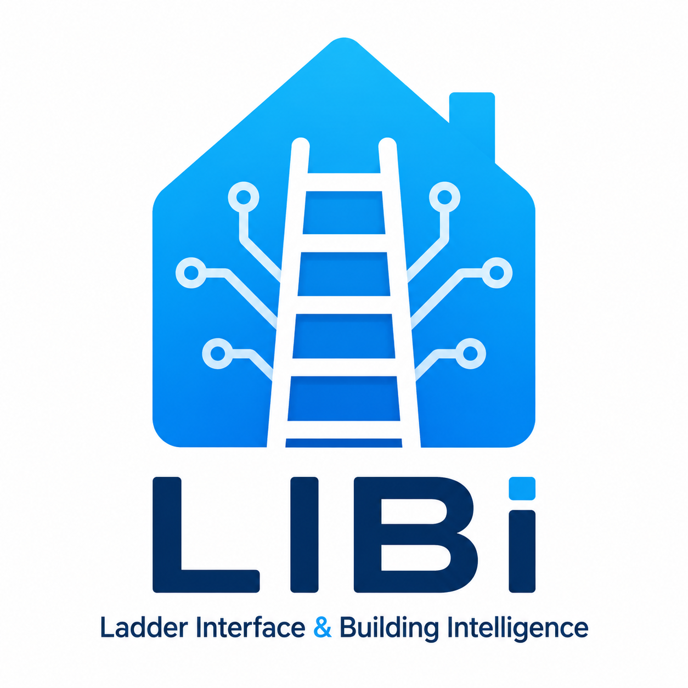
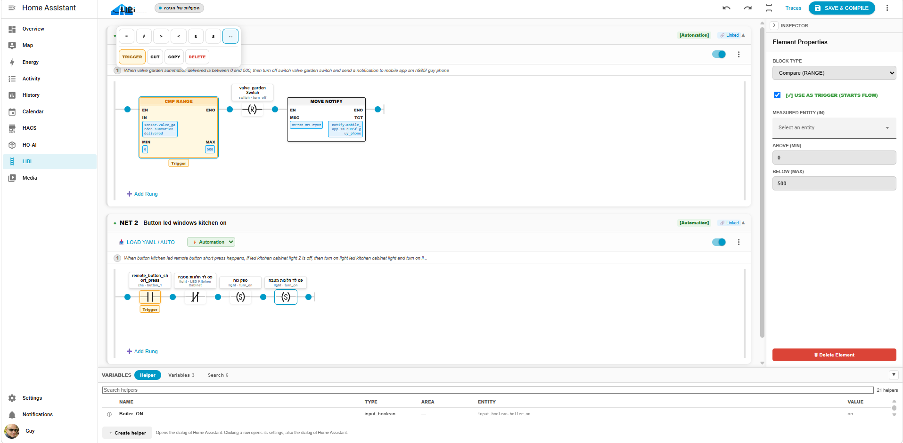
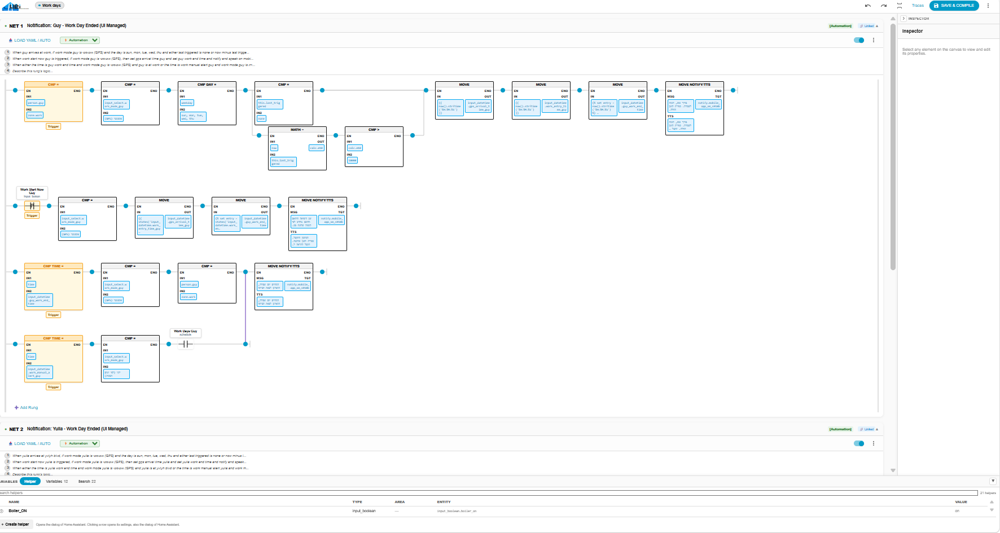

  

# **LIBI (Ladder Interface & Building Intelligence)**

> [!CAUTION]
> **⚠️ IMPORTANT NOTE: BETA SOFTWARE**
> 
> LIBI is currently in BETA. It is not recommended to install this on a production system unless you are deeply curious, willing to experiment, and want to help test and improve the project.

## **Not a Node-RED Replacement**

**Please note:** LIBI is *not* intended to replace Node-RED. It is simply an alternative approach to writing automations in Home Assistant. It is specifically designed for electricians, PLC (Programmable Logic Controller) programmers, or anyone who prefers a straightforward, graphical way to learn and write logic.

## **What is LIBI?**

LIBI is a graphical editor that takes your existing Home Assistant automations and automatically translates them into a LADDER logic representation. It allows you to:

* Add and modify automation logic using a visual interface.  
* Save the resulting logic directly back to standard Home Assistant YAML files.  
* Execute the automations natively within Home Assistant, just like any standard automation.

### **IEC 61131-3 Compliance**

The software is built upon the **IEC 61131-3** standard, the international standard defining programming languages for PLCs. Specifically, LIBI utilizes:

* **LD (Ladder Diagram):** The classic ladder logic format, adapted with minor deviations to ensure seamless compatibility with Home Assistant's native entities and execution models.

## **Key Features**

* **Integrated Helper Management:** Search for, manage, and insert variables (Helpers) directly from within the graphical editor.  
* **Project and File Grouping:** Save and manage groups of YAML files collectively. In LIBI, every **NET** functions as an individual YAML file. This allows you to open a single project and view all related ladders (e.g., "Garden Automations", "Security Automations") in one unified workspace.

## **🚀 Future Roadmap**

* **AI-Powered Logic Generation:** One of our upcoming milestones is integrating AI capabilities. Users will be able to generate LADDER logic simply by writing a natural language query and selecting the relevant variables.

Made with ❤️ for the Home Assistant community by Guy Azria
